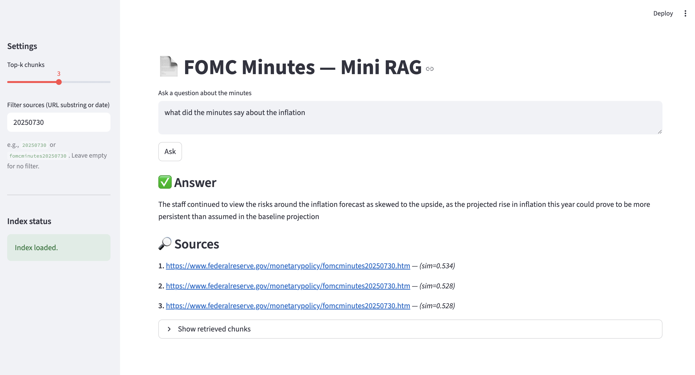

c# FOMC-Minutes-LLM
Mini LLM project for FOMC meeting minutes Q&amp;A
# FOMC Minutes — Mini RAG

A tiny, practical Retrieval-Augmented Generation (RAG) app to query **Federal Reserve FOMC meeting minutes**.  
It fetches minutes from federalreserve.gov, chunks & embeds them locally, and uses a small local T5 model to answer questions with citations.



<p align="left">
  <a href="https://github.com/Qinkai-Yin/FOMC-Minutes-LLM/stargazers"></a>
  <a href="https://github.com/Qinkai-Yin/FOMC-Minutes-LLM/issues"></a>
  
  
</p>

---

## ✨ What this project does

- **Fetch** FOMC minutes (HTML) and convert to clean text
- **Index**: chunk + embed locally with `sentence-transformers/all-MiniLM-L6-v2`
- **Retrieve** top-k relevant chunks by cosine similarity
- **Generate** answers with a small local model (`google/flan-t5-small`), plus **source links**
- **UI**: a simple Streamlit app + a CLI for power users

---

## 🧭 Project structure
app/
fetch_minutes.py # fetch HTML -> text
build_index.py # build embeddings + chunks
rag_cli.py # command-line Q&A
streamlit_app.py # web UI
data/
raw/ # original HTML
text/ # cleaned .txt
index/
embeddings.npy # float32 matrix (normalized)
chunks.json # chunks + metadata (incl. source_url)
.gitignore
LICENSE (MIT)
README.md

## 🚀 Quickstart

> Python 3.10+ recommended. Apple Silicon / M1+ will use Metal (MPS) automatically if available.

1) Clone & setup
   ```bash
   git clone git@github.com:Qinkai-Yin/FOMC-Minutes-LLM.git
   cd FOMC-Minutes-LLM
   python3 -m venv .venv && source .venv/bin/activate
   pip install -r requirements.txt

2) Fetch minutes — Latest N from the calendar
python app/fetch_minutes.py --limit 10

3) Fetch minutes — Or specific links (comma separated)
python app/fetch_minutes.py --urls "https://www.federalreserve.gov/monetarypolicy/fomcminutes20250730.htm,https://www.federalreserve.gov/monetarypolicy/fomcminutes20250618.htm"

4) Build the index
python app/build_index.py

5) Ask questions (CLI) — General
python app/rag_cli.py --q "What did the Committee say about inflation risks?"

6) Ask questions (CLI) — Focus on a specific day
python app/rag_cli.py --q "What are the key takeaways?" --k 2 --only 20250730

7) Web UI (Streamlit)
streamlit run app/streamlit_app.py

